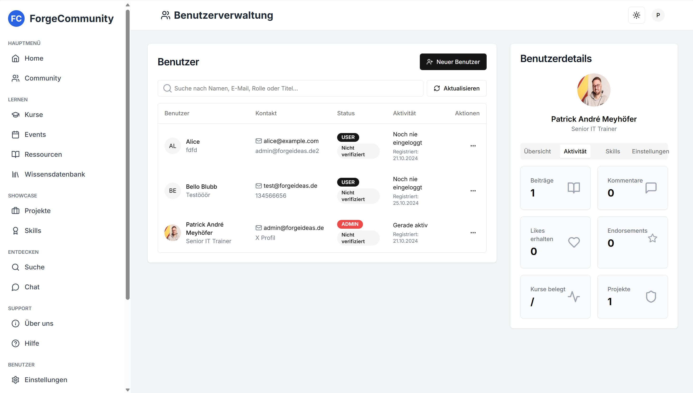

# ForgeCommunity

[](LICENSE)
[](https://nextjs.org/)
[](https://www.typescriptlang.org/)
[](https://tailwindcss.com/)
[](https://www.prisma.io/)
[](CONTRIBUTING.md)
[](https://github.com/yourusername/forgeCommunity/pulls)
[](https://prettier.io/)

ForgeCommunity is a comprehensive platform designed to foster learning, collaboration, and community engagement. It provides a space for users to access courses, participate in events, and connect with other community members.




## Features

- **Home**: A welcoming dashboard that provides an overview of the platform's features and recent activities.
- **Community**: A space for members to interact, share ideas, and collaborate on projects.
- **Courses**: Access to a wide range of educational content and learning materials.
- **Events**: A calendar view of upcoming events, workshops, and meetups.
- **Members**: A directory of community members, facilitating networking and collaboration.
- **About**: Information about the platform, its mission, and the team behind it.
- **Search**: A powerful search functionality to find content across the platform.
- **Chat**: Real-time messaging capabilities for direct communication between members.
- **Notifications**: A system to keep users informed about important updates and activities.
- **Knowledge Base**: A comprehensive repository of shared knowledge and resources.
- **Projects**: Collaborative space for working on and showcasing community projects.
- **Skills**: Track and showcase member competencies and expertise.
- **Certificate Verification**: System to verify course completion certificates.

## Technology Stack

- **Frontend**: Next.js 14 with TypeScript
- **UI Components**: Shadcn UI
- **Styling**: Tailwind CSS
- **Database**: Prisma ORM
- **Authentication**: NextAuth.js
- **State Management**: React Context
- **Icons**: Lucide React
- **Date Handling**: date-fns
- **Rich Text Editor**: Tiptap
- **Drag and Drop**: DND Kit
- **API Handling**: Axios

## Prerequisites

Before you begin, ensure you have the following installed:
- Node.js (v18 or higher)
- npm or yarn
- Git
- A PostgreSQL database

## Installation

1. Clone the repository:
```bash
git clone https://github.com/storminator89/forgeCommunity.git
cd forgeCommunity
```

2. Install dependencies:
```bash
npm install
# or
yarn install
```

3. Set up environment variables:
```bash
cp .env.example .env
```
Edit the `.env` file with your configuration:
- Database connection URL
- NextAuth secret
- Any other required API keys

4. Set up the database:
```bash
npx prisma generate
npx prisma db push
npm run db:seed # Optional: Seed the database with initial data
```

## Development

To run the development server:
```bash
npm run dev
# or
yarn dev
```

The application will be available at `http://localhost:3000`

## Building for Production

```bash
npm run build
npm run start
# or
yarn build
yarn start
```

## Contributing

1. Fork the repository
2. Create your feature branch (`git checkout -b feature/AmazingFeature`)
3. Commit your changes (`git commit -m 'Add some AmazingFeature'`)
4. Push to the branch (`git push origin feature/AmazingFeature`)
5. Open a Pull Request

## License

This project is licensed under the Apache License, Version 2.0 - see the LICENSE file for details.
